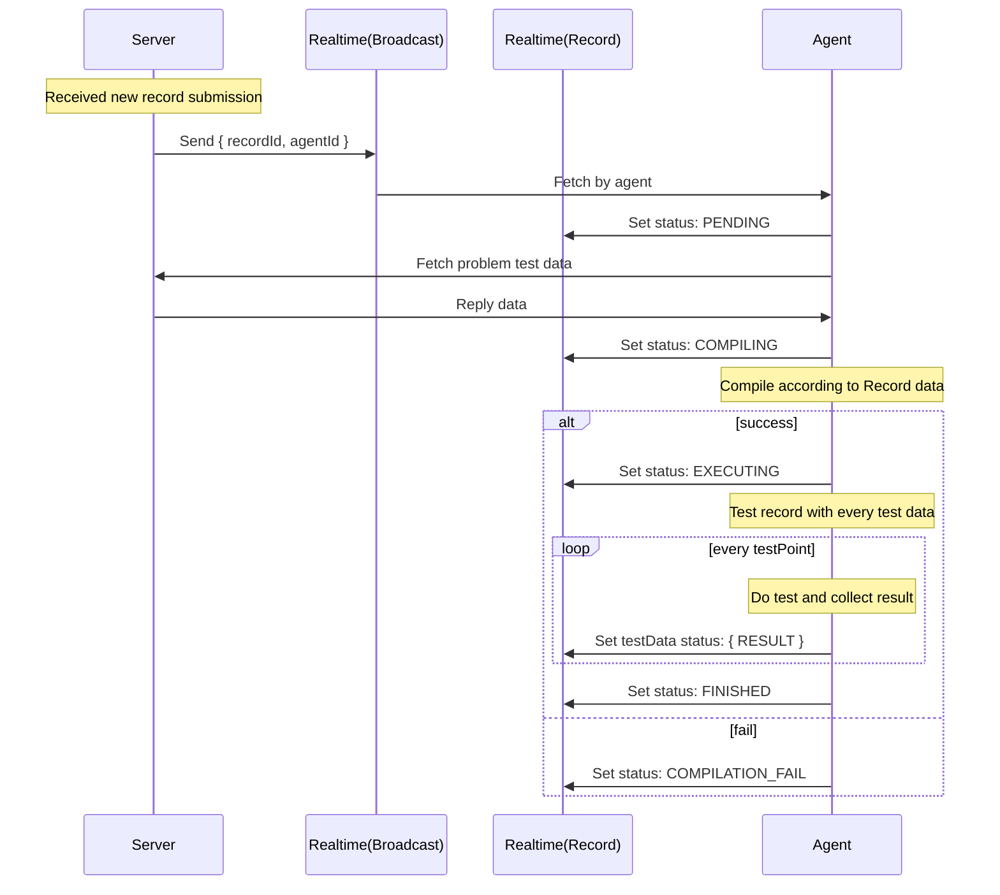

```mermaid
sequenceDiagram
	participant Server
	participant RT_B as Realtime(Broadcast)
	participant RT_R as Realtime(Record)
	participant Agent
	Note over Server: Received new record submission 
	Server->>RT_B: Send { recordId, agentId }
	RT_B->>Agent: Fetch by agent
	Agent->>RT_R: Set status: PENDING
	Agent->>Server: Fetch problem test data
	Server->> Agent: Reply data
	Agent->>RT_R: Set status: COMPILING
	Note over Agent: Compile according to Record data
	alt success
	Agent->>RT_R: Set status: EXECUTING
	Note over Agent: Test record with every test data
	loop every testPoint
	Note over Agent: Do test and collect result
	Agent->> RT_R: Set testData status: { RESULT }
	end
	Agent->>RT_R: Set status: FINISHED
	else fail
	Agent->>RT_R: Set status: COMPILATION_FAIL
	end
```
