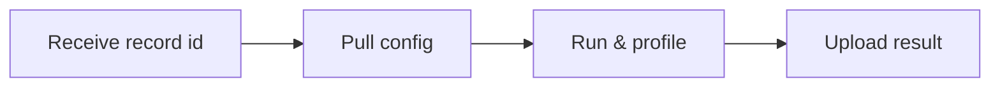

# Agent

## Role

Agent is a software to run source code submitted by users.
Based on its function, it is suggested to be deployed in a container.
It does everything automatically including compile code, run program and monitor performance.

## Tasks

It supports parallel testing if resource is abundant.
