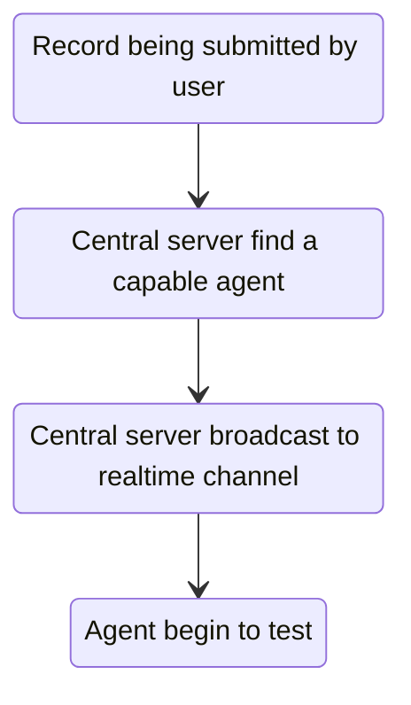

# Record allocation

## Description

When there's a record being submitted, server will find a capable agent
which is able to run the programming language required by the record to run tests.

## Channel

The allocation is broadcasted through Supabase Channel `phijudge.record.alloc`.
Be noticed, all agents are connected to the channel so they can get to know if they have
been allocated a record to test.

## Message

```json
{
	"recordId": <number>,
	"agentId": <string>
}
```

## Steps


